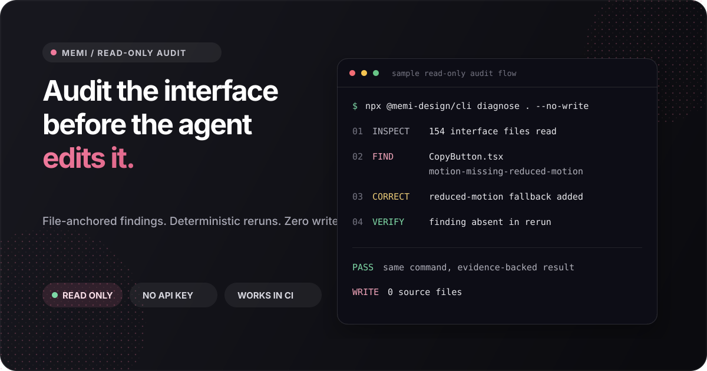

<p align="center">
  
</p>

<p align="center">
  <a href="https://www.npmjs.com/package/@memi-design/cli"></a>
  <a href="https://www.npmjs.com/package/@memi-design/cli"></a>
  <a href="https://github.com/memi-design/memi/actions/workflows/ci.yml"></a>
  <a href="https://github.com/memi-design/memi/stargazers"></a>
  <a href="https://github.com/memi-design/memi/blob/main/LICENSE"></a>
</p>

# memi

Read-only design engineering for coding agents.

Memi is the **read-only design engineering audit and skill layer for coding agents**. It gives Codex, Claude Code, Cursor, Grok Build, and MCP clients file-anchored interface evidence before they edit UI.

Memi reads the product you already have, identifies accessibility, hierarchy, state, responsive, motion, and token risks, then reruns the same deterministic check after a fix. Your code remains the source of truth.

**Supported today:** Node 20, 22, and 24 on macOS, Linux, and Windows. Figma and [Studio](https://memoire.cv/download) are optional companions.

**Links:** [npm](https://www.npmjs.com/package/@memi-design/cli) · [memoire.cv](https://memoire.cv) · [current versions](docs/CURRENT_RELEASE.md) · [MCP Registry](https://registry.modelcontextprotocol.io) · [Agent Skills](https://skills.sh/memi-design/memi)

## Quickstart

Run one audit in any frontend repository:

```bash
npx -y @memi-design/cli@2.6.3 diagnose . --json --no-write --fail-on none
```

You get a score, normalized finding IDs, confidence, provenance, and `file:line` evidence. No account, API key, Figma file, global install, or daemon is required.

Keep the workflow available to your coding agent:

```bash
npx skills add memi-design/memi --skill audit-frontend-design
```

Then ask:

> Audit this frontend before editing it. Prioritize the five fixes that will matter most to users.

| Focused skill | Use it when |
| --- | --- |
| `audit-frontend-design` | Find interface risks before changing UI |
| `remember-design-system` | Load compact product-system context |
| `enforce-design-ci` | Gate pull requests with deterministic evidence |
| `build-swiftui-interface` | Build and verify native Apple interfaces |

Compatible with the [shadcn registry](https://ui.shadcn.com/docs/registry/getting-started) and [v0 design systems](https://v0.app/docs/design-systems).

If Memi catches a real interface issue in your project, [star the repository](https://github.com/memi-design/memi) and [share the finding](https://github.com/memi-design/memi/discussions/categories/show-and-tell). That is the most useful signal for deciding what to improve next.

## What Memi catches

| Signal | Example evidence |
| --- | --- |
| Accessibility | Missing labels, reduced-motion fallbacks, focus and contrast risks |
| Interface craft | Weak hierarchy, spacing drift, brittle responsive behavior |
| Product states | Missing loading, empty, error, success, and permission states |
| Design systems | Token drift, raw values, inconsistent component usage |
| Routes and components | App graph, duplicated patterns, risky change surfaces |
| Pull requests | New debt only, SARIF annotations, step summary, HTML report |

The first command is deliberately read-only. Write-capable scaffolds and Figma operations are separate, explicit workflows.

## How it works

1. **Inspect** - build an evidence graph from source, routes, styles, and local design-system files.
2. **Find** - report normalized issues with severity, confidence, provenance, and `file:line`.
3. **Correct** - let a human or coding agent make a scoped change.
4. **Verify** - rerun the same command and compare the evidence.

No LLM is used in the deterministic CI enforcement path.

## Choose your integration

| Surface | Start here | Best for |
| --- | --- | --- |
| One-time CLI audit | `npx -y @memi-design/cli@2.6.3 diagnose . --no-write` | Trying Memi without installing |
| Global CLI | `npm i -g @memi-design/cli` | Daily local use |
| Agent Skill | `npx skills add memi-design/memi --skill audit-frontend-design` | Codex, Claude, Cursor, and compatible agents |
| GitHub Action | `uses: memi-design/memi@0f89cbf1b9972c779dbf14cc09f6c91485a1182b` | Pull-request design CI |
| MCP server | `memi mcp start --no-figma` | Any MCP client |
| Studio | `brew install --cask memi-design/memi/memi-studio` | Supervised macOS workflows |

The CLI and focused skills are primary. Studio, Figma, research, scaffolding, registries, and the larger tool router are deeper paths.

## Design CI

Pin the release commit so every pull request runs the same code:

```yaml
name: design
on: [pull_request]

permissions:
  contents: read

jobs:
  memi:
    runs-on: ubuntu-latest
    permissions:
      contents: read
      security-events: write
    steps:
      - uses: actions/checkout@3d3c42e5aac5ba805825da76410c181273ba90b1 # v7.0.1
        with:
          fetch-depth: 0
      - uses: memi-design/memi@0f89cbf1b9972c779dbf14cc09f6c91485a1182b # v2.6.3
        with:
          version: "2.6.3"
          report: true
          upload-sarif: true
```

The Action adds code-scanning annotations, a step summary, and a `memi-design-health` artifact. Existing debt can be baselined while new debt fails the gate.

[GitHub Action guide](docs/GITHUB_ACTION_MARKETPLACE.md) · [CI recipes](docs/CI_RECIPES.md) · [team rollout](docs/TEAM_ROLLOUT.md)

## Agent and MCP setup

Install a complete project kit:

```bash
memi agent install codex --project .
memi agent install claude-code --project .
memi agent install cursor --project .
memi agent install grok-build --project .
```

Start the local MCP server without Figma:

```bash
memi mcp start --no-figma
```

```json
{
  "mcpServers": {
    "memoire": {
      "command": "memi",
      "args": ["mcp", "start", "--no-figma"]
    }
  }
}
```

Codex plugin marketplace:

```bash
codex plugin marketplace add memi-design/memi --ref main --sparse .agents/plugins --sparse plugins/memoire
```

[Agent stack guide](docs/AGENT_STACKS.md) · [copy-paste recipes](docs/AGENT_RECIPES.md) · [full skill router](skills/memoire-design-tooling/SKILL.md)

## Proof you can inspect

- [design-sandbox](https://github.com/memi-design/design-sandbox) - runnable Next.js, Tailwind, shadcn, MCP, and Agent Skills integration.
- [Release gates](docs/RELEASE_GATES.md) - package, provenance, clean install, MCP, plugin, binary, and public-surface checks.
- [Current release truth](docs/CURRENT_RELEASE.md) - one source for npm, GitHub, Action, Studio, and website versions.
- [Audit reports](docs/audits/) - timestamped findings, evidence gaps, score caps, and owners.
- [`llms.txt`](llms.txt) - compact machine-readable product map.

## Trust defaults

- Read-only audit by default
- No npm install-time lifecycle scripts
- No account or API key for the first audit
- No source upload or covert telemetry
- Figma installation and connection are explicit
- Agent kit writes support `--dry-run --json`
- Immutable Action pins and release provenance
- MIT core with third-party boundaries documented in [NOTICE](NOTICE)

## Community

- [Ask a question](https://github.com/memi-design/memi/discussions/categories/q-a)
- [Show what Memi found](https://github.com/memi-design/memi/discussions/categories/show-and-tell)
- [Report a bug](https://github.com/memi-design/memi/issues/new?template=bug_report.md)
- [Request a feature](https://github.com/memi-design/memi/issues/new?template=feature_request.md)
- [Contribute](CONTRIBUTING.md)

Useful contributions include reproducible audit fixtures, framework adapters, skill improvements, accessible UI cases, shader and motion checks, and real before/after reports.

## More commands

<details>
<summary>CLI reference</summary>

| Command | What it does |
| --- | --- |
| `memi diagnose [target]` | App-quality graph and file-anchored findings |
| `memi ux audit [target]` | UX tenets and product-state risks |
| `memi craft audit [target]` | Hierarchy, rhythm, convention, and responsive critique |
| `memi tokens --from <path>` | Extract tokens, aliases, modes, and drift |
| `memi agent brief . --json` | Compact evidence contract before UI work |
| `memi scaffold component <Name> --json` | Dry-run Atomic Design scaffold |
| `memi ios brief --json` | Apple-platform design brief |
| `memi shadcn export --out public/r` | Export a shadcn-compatible registry |
| `memi research design --json` | Research-to-design package |
| `memi ci` | Baseline-aware pull-request gate |
| `memi mcp start --no-figma` | Local MCP server |

</details>

## Install without npm

```bash
curl -fsSL https://memoire.cv/install.sh | sh
brew install memi-design/memi/memoire
docker run --rm -it -v "$PWD:/work" -w /work ghcr.io/memi-design/memi --help
```

## License

Studio interface references and adapted components include Hermes WebUI and the MIT Warp UI framework boundary around `warpui_core` and `warpui`; Warp AGPL application and client code is not copied into Memi.

MIT. See [NOTICE](NOTICE) for optional adapters and complete third-party attribution.
